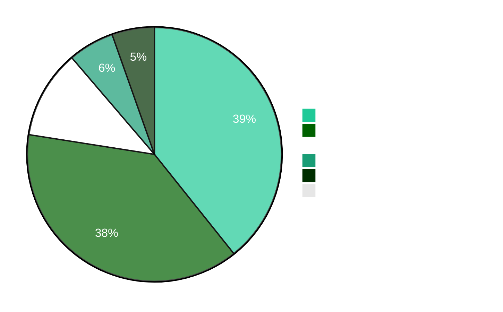
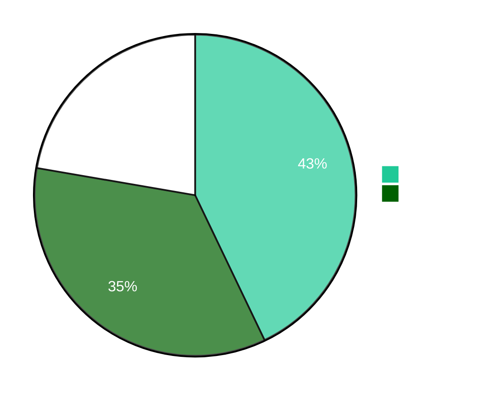

  

  
### Computer Science & Engineering (AI & ML) | Full-Stack Developer | AI Enthusiast

  <em>Passionate about designing intelligent systems and building scalable web solutions. 
  Bridging the gap between software engineering and artificial intelligence to create meaningful impact.</em>

---

##  About Me

- **Role:** Full-Stack Developer & AI/ML Enthusiast
- **Education:** Computer Science and Engineering (AI & ML)
- **Institution:** Kalaignar Karunanidhi Institute of Technology
- **Location:** India
- **Focus Areas:**
  - Intelligent Systems
  - Scalable Architectures
  - Web Solutions
- **Currently Learning:**
  - System Design
  - Advanced ML
  - Cloud Architecture
- **Philosophy:** Always curious, always learning — building technology that makes a difference.
---

##  Technical Stack

### Languages & Frameworks

### Databases & Tools

### Specializations

---

##  Competitive Programming Statistics

### Overall Performance Metrics

<table>
<tr>
<td align="center" width="25%">
 
<h3>1005</h3>
Total Problems Solved
</td>
<td align="center" width="25%">
 
<h3>227</h3>
Active Days
</td>
<td align="center" width="25%">
 
<h3>812</h3>
Total Submissions
</td>
<td align="center" width="25%">
 
<h3>22</h3>
Maximum Streak
</td>
</tr>
</table>

###  Platform-wise Problem Solving

#### DSA & Problem Solving

<table>
<tr>
<td align="center" width="50%">

**LeetCode**

**Total: 443 Problems**

</td>
<td align="center" width="50%">

**GeeksforGeeks**

**Institute: KKIT**

</td>
</tr>
</table>

#### Competitive Programming

<table>
<tr>
<td align="center" width="50%">

**CodeChef**

</td>
<td align="center" width="50%">

**Codeforces**

-1F8ACB?style=flat-square&logo=codeforces&logoColor=white)

</td>
</tr>
</table>

#### Fundamentals & Practice

<table>
<tr>
<td align="center" width="50%">

**HackerRank**

</td>
<td align="center" width="50%">

**CodeStudio**

</td>
</tr>
</table>

###  Problem Analysis & Language Proficiency

<table>
<tr>
<td width="50%" align="center">

#### Problem Distribution

</td>
<td width="50%" align="center">

#### Language Proficiency

###  Achievements & Recognition

---

##  Current Focus

<table align="center">
<tr>
<td align="center" width="33%">
 
<b>Full-Stack Development</b> 
Building robust, scalable applications
</td>
<td align="center" width="33%">
 
<b>AI/ML Systems</b> 
Creating intelligent solutions
</td>
<td align="center" width="33%">
 
<b>System Architecture</b> 
Mastering scalable design patterns
</td>
</tr>
</table>

---

##  Featured Projects

### DigiScaler1 - Influencer-Brand Collaborative Platform
  

A comprehensive full-stack platform connecting influencers and brands for seamless collaboration.

**Key Features:** Campaign Management | Influencer Discovery | Analytics Dashboard | Secure Messaging

**Tech Stack:** Next.js | MongoDB | Node.js | React

---

### Code Vulnerability Scanner
  

An intelligent Python security analysis tool that identifies vulnerabilities and ensures code safety.

**Key Features:** Automated Detection | Security Reports | Fast Scanning | Best Practices

**Tech Stack:** Python | Static Analysis | Security Patterns

---

##  GitHub Analytics

  
  

  

---

##  Contribution Graph

  

---

##  Connect With Me

---

  
  
  
Open to collaborations and exciting opportunities

  
  From [DavidVensilinR](https://github.com/DavidVensilinR) | Last Updated: October 2025

